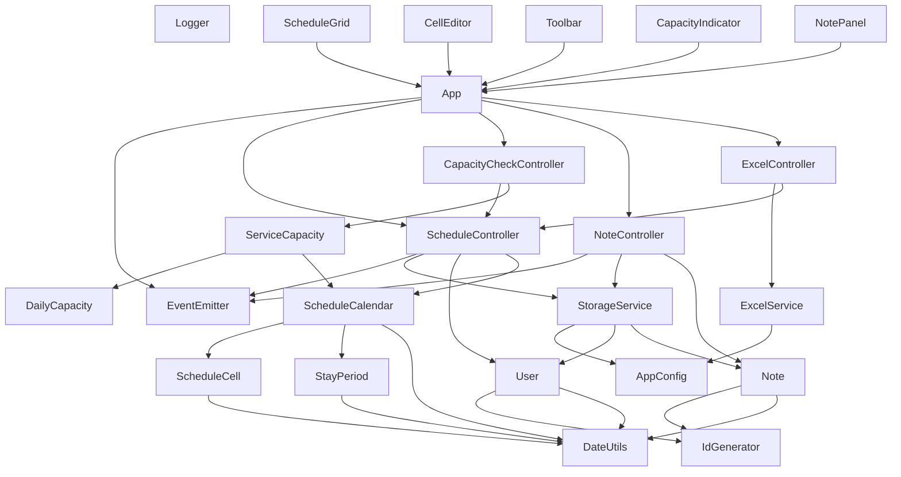

# 小規模多機能利用調整システム Phase 1 クラス設計書（統合版 v1.6）

## 0. プロジェクト概要

### 0.1 目的
小規模多機能型居宅介護の利用予定を効率的に調整するためのWebアプリケーション

### 0.2 技術的条件
- JavaScriptでオブジェクト指向プログラミング
- ブラウザ上で動作
- データ入出力はExcelで行う
- LocalStorageでデータ永続化

### 0.3 主要機能
- 利用者29人分の予定管理（通い・泊り・訪問）
- 定員チェック（通い15人、泊り9人）
- 入所〜退所の区間自動処理
- 利用者備考・セル備考の管理
- Excel入出力（現行フォーマット準拠）

### 0.4 改訂履歴と重要な変更点

#### v1.6での統合内容（2025-11-11）
**実装フィードバックによる改善**:
- ✅ コンストラクタ引数の明確化と初期化例の追加
- ✅ メソッド名の統一（getCurrentYearMonth()に統一）
- ✅ 依存関係グラフの追加
- ✅ main.jsの責務定義を明確化
- ✅ 詳細なクラス図と処理フローを保持
- ✅ UI設計情報を保持

---

## 1. 全体アーキテクチャ

### 1.1 レイヤー構成

```
┌─────────────────────────────────────┐
│         Presentation Layer          │
│  (UIComponents - 画面表示・操作)    │
├─────────────────────────────────────┤
│         Application Layer           │
│  (Controllers - ビジネスロジック)   │
├─────────────────────────────────────┤
│           Domain Layer              │
│  (Models - ドメインモデル)          │
├─────────────────────────────────────┤
│      Infrastructure Layer           │
│  (Storage, Excel - データ永続化)    │
└─────────────────────────────────────┘
```

### 1.2 依存関係グラフ（新規追加）



---

## 2. クラス図

### 2.1 Domain Layer（ドメインモデル）

#### 2.1.1 Userクラス（利用者）

```
┌─────────────────────────────┐
│   User                      │ 利用者
├─────────────────────────────┤
│ - id: string                │ 利用者ID
│ - name: string              │ 氏名
│ - registrationDate: Date    │ 登録日
│ - note: string              │ 備考
│ - isActive: boolean         │ 利用中フラグ
├─────────────────────────────┤
│ + toJSON(): object          │
│ + fromJSON(data): User      │
└─────────────────────────────┘
```

#### 2.1.2 ScheduleCellクラス（予定セル）

```
┌─────────────────────────────┐
│   ScheduleCell              │ 予定セル
├─────────────────────────────┤
│ - userId: string            │
│ - date: Date                │
│ - cellType: string          │ "dayStay" | "visit"
│ - inputValue: string        │ "1", "入所", "退所", 数値等
│ - note: string              │ セル備考
│                             │
│ 【計算結果フラグ】          │
│ - actualFlags: object       │
│   ├ day: boolean            │ 通いフラグ
│   ├ stay: boolean           │ 泊りフラグ
│   └ visit: number           │ 訪問回数
│                             │
├─────────────────────────────┤
│ + isEmpty(): boolean        │
│ + isStayStart(): boolean    │ "入所"判定
│ + isStayEnd(): boolean      │ "退所"判定
│ + hasNote(): boolean        │
│ + toJSON(): object          │
└─────────────────────────────┘
```

#### 2.1.3 StayPeriodクラス（宿泊期間）

```
┌─────────────────────────────┐
│   StayPeriod                │ 宿泊期間
├─────────────────────────────┤
│ - startDate: Date           │ 入所日
│ - endDate: Date             │ 退所日
│ - userId: string            │ 利用者ID
├─────────────────────────────┤
│ + getDates(): Date[]        │ 期間内全日付
│ + contains(date): boolean   │ 日付が期間内か
│ + getDuration(): number     │ 宿泊日数
│ + toJSON(): object          │
└─────────────────────────────┘
```

#### 2.1.4 ScheduleCalendarクラス（利用者月間予定）

```
┌──────────────────────────────┐
│   ScheduleCalendar           │ 利用者月間予定
├──────────────────────────────┤
│ - userId: string             │
│ - yearMonth: string          │ "2025-12"
│ - cells: Map<date, ScheduleCell>│
│ - stayPeriods: StayPeriod[]  │
├──────────────────────────────┤
│ + setCell(date, type, value): void│
│ + getCell(date, type): ScheduleCell│
│ + calculateStayPeriods(): void│ 入所〜退所を計算
│ + calculateAllFlags(): void  │ stay/dayフラグ計算
│ + getDaysInMonth(): Date[]   │
│ + toJSON(): object           │
└──────────────────────────────┘
```

#### 2.1.5 DailyCapacityクラス（日別定員）

```
┌──────────────────────────────┐
│   DailyCapacity              │ 日別定員
├──────────────────────────────┤
│ - date: Date                 │
│ - dayCount: number           │ 通い利用者数
│ - stayCount: number          │ 泊り利用者数
│ - visitCount: number         │ 訪問回数合計
│ - dayLimit: number           │ 通い定員(15)
│ - stayLimit: number          │ 泊り定員(9)
├──────────────────────────────┤
│ + isOverCapacity(): boolean  │
│ + getDayOverflow(): number   │
│ + getStayOverflow(): number  │
│ + getUtilizationRate(): object│
└──────────────────────────────┘
```

#### 2.1.6 ServiceCapacityクラス（定員管理）

```
┌──────────────────────────────┐
│   ServiceCapacity            │ 定員管理
├──────────────────────────────┤
│ - calendars: ScheduleCalendar[]│
├──────────────────────────────┤
│ + checkDate(date): DailyCapacity│
│ + checkMonth(yearMonth): DailyCapacity[]│
│ + getOverCapacityDates(): Date[]│
│ + getSummary(): object       │
└──────────────────────────────┘
```

#### 2.1.7 Noteクラス（備考）

```
┌──────────────────────────────┐
│   Note                       │ 備考
├──────────────────────────────┤
│ - id: string                 │
│ - targetType: string         │ "user" | "cell"
│ - targetId: string           │
│ - content: string            │
│ - createdAt: Date            │
│ - updatedAt: Date            │
├──────────────────────────────┤
│ + isUserNote(): boolean      │
│ + isCellNote(): boolean      │
│ + toJSON(): object           │
└──────────────────────────────┘
```

---

### 2.2 Application Layer（コントローラー）

#### 2.2.1 ScheduleControllerクラス（修正版：依存関係明確化）

```
┌──────────────────────────────┐
│  ScheduleController          │ 予定管理
├──────────────────────────────┤
│ - storageService: StorageService│
│ - currentYearMonth: string   │
│ - users: User[]              │
│ - calendars: Map<userId, ScheduleCalendar>│
├──────────────────────────────┤
│ + getCurrentYearMonth(): string│ ✅修正済
│ + loadUsers(): void          │
│ + loadSchedule(yearMonth): void│
│ + saveSchedule(): void       │
│ + updateCell(userId, date, type, value): void│
│ + getCalendar(userId): ScheduleCalendar│
│ + getAllCalendars(): ScheduleCalendar[]│
│ + recalculateAllFlags(): void│
└──────────────────────────────┘
```

#### 2.2.2 CapacityCheckControllerクラス（修正版：コンストラクタ引数明確化）

```
┌──────────────────────────────┐
│ CapacityCheckController      │ 定員チェック
├──────────────────────────────┤
│ - scheduleController: ScheduleController│ ✅必須引数
│ - serviceCapacity: ServiceCapacity│
├──────────────────────────────┤
│ + checkAll(): DailyCapacity[]│
│ + checkDate(date): DailyCapacity│
│ + getOverCapacityDates(): Date[]│
│ + getSummary(): object       │
└──────────────────────────────┘
```

#### 2.2.3 NoteControllerクラス

```
┌──────────────────────────────┐
│ NoteController               │ 備考管理
├──────────────────────────────┤
│ - notes: Map<id, Note>       │
│ - storageService: StorageService│
├──────────────────────────────┤
│ + getUserNotes(userId): Note[]│ ✅修正済
│ + getCellNote(cellId): Note  │
│ + saveNote(note): void       │
│ + deleteNote(id): void       │
│ + hasNote(targetType, targetId): boolean│
└──────────────────────────────┘
```

#### 2.2.4 ExcelControllerクラス（修正版：コンストラクタ引数修正）

```
┌──────────────────────────────┐
│ ExcelController              │ Excel入出力
├──────────────────────────────┤
│ - excelService: ExcelService │ ✅必須引数
│ - scheduleController: ScheduleController│ ✅必須引数
├──────────────────────────────┤
│ + importFromExcel(file): void│
│ + exportTemplate(yearMonth): Blob│ ✅修正済
│ + parseCurrentFormat(sheet): object│
│ + generateCurrentFormat(data): Workbook│
└──────────────────────────────┘
```

---

### 2.3 Infrastructure Layer（永続化・外部連携）

#### 2.3.1 StorageServiceクラス

```
┌──────────────────────────────┐
│  StorageService              │ LocalStorage操作
├──────────────────────────────┤
│ - storageKeys: object        │
├──────────────────────────────┤
│ + save(key, data): boolean   │
│ + load(key, defaultValue): any│
│ + saveSchedule(yearMonth, data): boolean│
│ + loadSchedule(yearMonth): object│
│ + listSchedules(): string[]  │
│ + saveUsers(users): boolean  │
│ + loadUsers(): User[]        │
│ + saveNotes(notes): boolean  │
│ + loadNotes(): Note[]        │
│ + clearAll(): void           │
└──────────────────────────────┘
```

#### 2.3.2 ExcelServiceクラス

```
┌──────────────────────────────┐
│  ExcelService                │ Excel読み書き（SheetJS）
├──────────────────────────────┤
│ - XLSX: object               │
├──────────────────────────────┤
│ + readFile(file): Promise<Workbook>│
│ + parseSheet(sheet, config): object│
│ + createWorkbook(): Workbook │
│ + writeSheet(data, config): Sheet│
│ + downloadFile(workbook, filename): void│
└──────────────────────────────┘
```

---

### 2.4 Presentation Layer（UIコンポーネント）

#### 2.4.1 Appクラス

```
┌──────────────────────────────┐
│  App                         │ アプリケーション本体
├──────────────────────────────┤
│ - currentYearMonth: string   │
│ - components: object         │
│ - controllers: object        │
│ - isInitialized: boolean     │
├──────────────────────────────┤
│ + init(): Promise<void>      │
│ + switchMonth(yearMonth): void│
│ + updateCell(userId, date, type, value): void│
│ + showNotePanel(target): void│
│ + showToast(message, type): void│
└──────────────────────────────┘
```

#### 2.4.2 ScheduleGridクラス

```
┌──────────────────────────────┐
│  ScheduleGrid                │ 予定グリッド
├──────────────────────────────┤
│ - app: App                   │
│ - container: HTMLElement     │
│ - currentData: object        │
├──────────────────────────────┤
│ + init(): void               │
│ + render(): void             │
│ + updateCell(userId, date): void│
│ + handleCellClick(event): void│
│ + applyCapacityColors(): void│
└──────────────────────────────┘
```

#### 2.4.3 CellEditorクラス

```
┌──────────────────────────────┐
│  CellEditor                  │ セル編集
├──────────────────────────────┤
│ - app: App                   │
│ - currentCell: object        │
│ - isEditing: boolean         │
├──────────────────────────────┤
│ + startEdit(cell): void      │
│ + finishEdit(): void         │
│ + cancelEdit(): void         │
│ + showQuickPalette(): void   │
└──────────────────────────────┘
```

#### 2.4.4 CapacityIndicatorクラス

```
┌──────────────────────────────┐
│  CapacityIndicator           │ 定員表示
├──────────────────────────────┤
│ - app: App                   │
│ - container: HTMLElement     │
├──────────────────────────────┤
│ + init(): void               │
│ + refresh(): void            │
│ + updateDailyDisplay(date): void│
│ + showOverCapacityAlert(): void│
└──────────────────────────────┘
```

#### 2.4.5 NotePanelクラス

```
┌──────────────────────────────┐
│  NotePanel                   │ 備考パネル
├──────────────────────────────┤
│ - app: App                   │
│ - isVisible: boolean         │
│ - currentTarget: object      │
├──────────────────────────────┤
│ + show(target): void         │
│ + hide(): void               │
│ + saveNote(): void           │
│ + deleteNote(): void         │
└──────────────────────────────┘
```

#### 2.4.6 Toolbarクラス

```
┌──────────────────────────────┐
│  Toolbar                     │ ツールバー
├──────────────────────────────┤
│ - app: App                   │
│ - container: HTMLElement     │
├──────────────────────────────┤
│ + init(): void               │
│ + renderMonthSelector(): void│
│ + handleExcelImport(): void  │
│ + handleExcelExport(): void  │
│ + handleCapacityCheck(): void│
└──────────────────────────────┘
```

---

## 3. 重要な処理フロー

### 3.1 入所〜退所の自動処理

```
1. ユーザーが「入所」を入力
   ↓
2. ScheduleCell.inputValue = "入所"
   ↓
3. ScheduleCalendar.calculateStayPeriods()
   - dayStayCellsを順にスキャン
   - "入所"を見つけたら startDate に設定
   - 次の"退所"を見つけたら endDate に設定
   - StayPeriod オブジェクトを生成
   ↓
4. ScheduleCalendar.calculateAllFlags()
   - 各StayPeriodについて
   - period.getDates() で期間内の全日付を取得
   - 各日付のセルに actualFlags.stay = true
   - 各日付のセルに actualFlags.day = true
   ↓
5. ServiceCapacity.checkDate()
   - 全利用者のactualFlagsを集計
   - 定員チェック
   ↓
6. UIに反映（色分け、集計表示）
```

### 3.2 セル編集の流れ

```
1. ユーザーがセルをクリック
   ↓
2. CellEditor.startEdit(cell)
   - セルのタイプ（通泊/訪問）を判定
   - 入力フィールドまたはクイック入力パレットを表示
   ↓
3. ユーザーが値を入力
   ↓
4. CellEditor.finishEdit()
   ↓
5. ScheduleController.updateCell(userId, date, type, value)
   - ScheduleCalendar.setCell()
   - calculateStayPeriods()（通泊セルの場合）
   - calculateAllFlags()
   ↓
6. CapacityCheckController.checkDate(date)
   ↓
7. UI更新
   - ScheduleGrid.updateCell()
   - CapacityIndicator.refresh()
```

---

## 4. 命名規則の統一（実装フィードバック反映）

### 4.1 メソッド命名の統一

| 目的 | 正しい命名 | 誤った命名 | 理由 |
|------|-----------|-----------|------|
| 年月取得 | getCurrentYearMonth() | getCurrentMonth() | JavaScriptのgetMonth()は0-11を返すため混乱を避ける |
| 日付取得 | getCurrentDate() | getToday() | 一般的なJavaScript慣習に従う |
| 現在の値 | getCurrentXxx() | getXxx() | 「現在」を明示 |
| 全体取得 | getAllXxx() | getXxx() | 単数形は1つ、複数形は全体 |

### 4.2 クラス命名規則

```javascript
// 良い例
class ScheduleController { }   // 名詞+Controller
class StorageService { }        // 名詞+Service
class ScheduleGrid { }          // UIコンポーネントは名詞のみ

// 悪い例
class Schedule { }              // 曖昧（ModelかControllerか不明）
class ControlSchedule { }       // 動詞始まり
```

---

## 5. コンストラクタ仕様の明確化（実装フィードバック反映）

### 3.1 統一ルール

**ルール1**: 依存オブジェクトは全て引数で受け取る
```javascript
// ✅ 良い例
class CapacityCheckController {
  constructor(scheduleController) {
    this.scheduleController = scheduleController;
  }
}

// ❌ 悪い例
class CapacityCheckController {
  constructor() {
    this.scheduleController = window.scheduleController; // グローバル参照NG
  }
}
```

**ルール2**: 初期化例を必ず記載
```javascript
/**
 * @param {ScheduleController} scheduleController
 * 
 * 初期化例:
 * const storage = new StorageService();
 * const schedule = new ScheduleController(storage);
 * const capacity = new CapacityCheckController(schedule);
 */
constructor(scheduleController) { }
```

**ルール3**: 依存関係チェックを最初に実行
```javascript
constructor(scheduleController) {
  if (!scheduleController) {
    throw new Error('ScheduleController is required');
  }
  this.scheduleController = scheduleController;
}
```

---

## 4. Application Layer（修正版）

### 4.1 ScheduleController

```javascript
class ScheduleController extends EventEmitter {
  /**
   * @param {StorageService} storageService
   * 
   * 初期化例:
   * const storage = new StorageService();
   * const controller = new ScheduleController(storage);
   */
  constructor(storageService) {
    super();
    
    if (!storageService) {
      throw new Error('StorageService is required');
    }
    
    this.storageService = storageService;
    this.currentYearMonth = null;
    this.users = [];
    this.calendars = new Map();
  }
  
  // メソッド名を統一
  getCurrentYearMonth() {  // ✅ 修正: getCurrentMonth() → getCurrentYearMonth()
    return this.currentYearMonth;
  }
  
  // ... 他のメソッド
}
```

### 4.2 CapacityCheckController

```javascript
class CapacityCheckController {
  /**
   * @param {ScheduleController} scheduleController
   * 
   * 初期化例:
   * const storage = new StorageService();
   * const schedule = new ScheduleController(storage);
   * const capacity = new CapacityCheckController(schedule);
   */
  constructor(scheduleController) {
    if (!scheduleController) {
      throw new Error('ScheduleController is required');
    }
    
    this.scheduleController = scheduleController;
    
    // イベントリスナー設定
    this.scheduleController.on('cellUpdated', () => {
      Logger?.debug('Cell updated, capacity check triggered');
    });
  }
  
  // ... メソッド
}
```

### 4.3 NoteController

```javascript
class NoteController extends EventEmitter {
  /**
   * @param {StorageService} storageService
   * 
   * 初期化例:
   * const storage = new StorageService();
   * const noteController = new NoteController(storage);
   */
  constructor(storageService) {
    super();
    
    if (!storageService) {
      throw new Error('StorageService is required');
    }
    
    this.storageService = storageService;
    this.notes = new Map();
  }
  
  // ... メソッド
}
```

### 4.4 ExcelController

```javascript
class ExcelController {
  /**
   * @param {ExcelService} excelService
   * @param {ScheduleController} scheduleController
   * 
   * 初期化例:
   * const excelService = new ExcelService();
   * const storage = new StorageService();
   * const schedule = new ScheduleController(storage);
   * const excel = new ExcelController(excelService, schedule);
   */
  constructor(excelService, scheduleController) {
    if (!excelService) {
      throw new Error('ExcelService is required');
    }
    if (!scheduleController) {
      throw new Error('ScheduleController is required');
    }
    
    this.excelService = excelService;
    this.scheduleController = scheduleController;
  }
  
  // ... メソッド
}
```

---

## 5. Presentation Layer（修正版）

### 5.1 App クラス

```javascript
class App extends EventEmitter {
  constructor() {
    super();
    
    this.currentYearMonth = null;
    this.controllers = {};
    this.components = {};
    this.isInitialized = false;
  }
  
  async init() {
    try {
      // 1. コントローラー初期化（Appの責務）
      this.initControllers();
      
      // 2. データ読み込み
      this.controllers.schedule.loadUsers();
      this.controllers.note.loadNotes();
      
      // 3. デフォルト月設定
      const now = new Date();
      this.currentYearMonth = DateUtils.getCurrentYearMonth();
      this.controllers.schedule.loadSchedule(this.currentYearMonth);
      
      // 4. UIコンポーネント初期化
      this.initComponents();
      
      // 5. イベントリスナー設定
      this.setupEventListeners();
      
      // 6. 初回レンダリング
      this.render();
      
      this.isInitialized = true;
      Logger?.info('App initialization completed');
      
    } catch (error) {
      Logger?.error('App initialization failed:', error);
      throw error;
    }
  }
  
  /**
   * コントローラー初期化
   * 注意: この処理はApp.jsのみで行う。main.jsでは行わない。
   */
  initControllers() {
    const storage = new StorageService();
    const excelService = new ExcelService();
    
    // 依存関係の順序を厳守
    this.controllers.schedule = new ScheduleController(storage);
    this.controllers.capacity = new CapacityCheckController(this.controllers.schedule);
    this.controllers.note = new NoteController(storage);
    this.controllers.excel = new ExcelController(excelService, this.controllers.schedule);
    
    Logger?.info('Controllers initialized');
  }
  
  // ... 他のメソッド
}
```

---

## 6. main.jsの責務定義（新規追加）

### 6.1 main.jsの役割

**唯一の責務**: アプリケーションのブートストラップ

### 6.2 やること

1. ✅ 依存関係チェック
2. ✅ Appクラスのインスタンス化と初期化
3. ✅ グローバルエラーハンドリング
4. ✅ デバッグ用のグローバル登録

### 6.3 やらないこと

- ❌ Controller個別の初期化（App.jsの責務）
- ❌ UIの構築（各Componentの責務）
- ❌ テストコードの実行（別ファイルに分離すべき）

### 6.4 正しいmain.js実装

```javascript
document.addEventListener('DOMContentLoaded', async () => {
  try {
    Logger.info('=== Application Starting ===');
    
    // 依存関係チェック
    const dependencies = [
      // Phase 1-A
      'Logger', 'EventEmitter', 'DateUtils', 'IdGenerator', 'AppConfig',
      // Phase 1-B
      'User', 'Note', 'ScheduleCell', 'StayPeriod', 'ScheduleCalendar',
      'DailyCapacity', 'ServiceCapacity',
      // Phase 1-C
      'StorageService', 'ExcelService',
      // Phase 1-D
      'ScheduleController', 'CapacityCheckController', 'NoteController', 'ExcelController',
      // Phase 1-E
      'App', 'ScheduleGrid', 'CellEditor', 'Toolbar', 'CapacityIndicator', 'NotePanel'
    ];
    
    const missing = dependencies.filter(dep => typeof window[dep] === 'undefined');
    
    if (missing.length > 0) {
      throw new Error(`Missing dependencies: ${missing.join(', ')}`);
    }
    
    Logger.info('All dependencies loaded');
    
    // Appクラスに全て委譲
    const app = new App();
    await app.init();
    
    // デバッグ用
    window.app = app;
    
    Logger.info('=== Application Ready ===');
    
  } catch (error) {
    Logger.error('Application failed to start:', error);
    
    // エラー表示
    const appContainer = document.getElementById('app');
    if (appContainer) {
      appContainer.innerHTML = `
        <div class="error-container">
          <h1>初期化エラー</h1>
          <p>${error.message}</p>
          <button onclick="location.reload()">再読み込み</button>
        </div>
      `;
    }
  }
});
```

---

## 7. 初期化シーケンス（新規追加）

### 7.1 全体フロー

```
main.js起動
  ↓
依存関係チェック
  ↓
App.init()
  ├─ initControllers()
  │   ├─ StorageService生成
  │   ├─ ExcelService生成
  │   ├─ ScheduleController生成
  │   ├─ CapacityCheckController生成
  │   ├─ NoteController生成
  │   └─ ExcelController生成
  ├─ データ読み込み
  │   ├─ loadUsers()
  │   └─ loadNotes()
  ├─ デフォルト月設定
  │   └─ loadSchedule(yearMonth)
  ├─ initComponents()
  │   ├─ ScheduleGrid生成
  │   ├─ CellEditor生成
  │   ├─ Toolbar生成
  │   ├─ CapacityIndicator生成
  │   └─ NotePanel生成
  ├─ setupEventListeners()
  └─ render()
```

### 7.2 依存関係の初期化順序

**レベル0**: ユーティリティ（依存なし）
- Logger, EventEmitter, DateUtils, IdGenerator, AppConfig

**レベル1**: サービス（ユーティリティに依存）
- StorageService, ExcelService

**レベル2**: コントローラー（サービスに依存）
- ScheduleController（StorageService）
- NoteController（StorageService）

**レベル3**: コントローラー（他のコントローラーに依存）
- CapacityCheckController（ScheduleController）
- ExcelController（ExcelService, ScheduleController）

**レベル4**: App（全コントローラーに依存）
- App

**レベル5**: コンポーネント（Appに依存）
- ScheduleGrid, CellEditor, Toolbar, CapacityIndicator, NotePanel

---

## 8. エラーハンドリングの責任分離（新規追加）

### 8.1 レイヤー別の責務

| レイヤー | 責務 | エラー処理 |
|---------|------|-----------|
| main.js | ブートストラップ | try-catch → ユーザーへの通知 |
| App.js | アプリ初期化 | try-catch → throw（main.jsに委譲）|
| Controllers | ビジネスロジック | try-catch → ログ + falseを返す |
| Components | UI更新 | try-catch → ログ + エラー表示 |
| Services | データ永続化 | try-catch → ログ + nullまたはfalse |

### 8.2 エラーの伝播ルール

```javascript
// Services: エラーを吸収してfalse/nullを返す
class StorageService {
  save(key, data) {
    try {
      // ... 保存処理
      return true;
    } catch (error) {
      Logger?.error('Save failed:', error);
      return false;  // ❌ throwしない
    }
  }
}

// Controllers: エラーを吸収してfalse/nullを返す
class ScheduleController {
  updateCell(userId, date, cellType, value) {
    try {
      // ... 更新処理
      return true;
    } catch (error) {
      Logger?.error('Update failed:', error);
      return false;  // ❌ throwしない
    }
  }
}

// App: 致命的エラーのみthrow
class App {
  async init() {
    try {
      // ... 初期化処理
    } catch (error) {
      Logger?.error('Init failed:', error);
      throw error;  // ✅ main.jsに委譲
    }
  }
}

// main.js: 最終的なエラーハンドリング
document.addEventListener('DOMContentLoaded', async () => {
  try {
    await app.init();
  } catch (error) {
    // ✅ ユーザーに通知
    showErrorUI(error);
  }
});
```

---

## 9. Phase別実装範囲

### Phase 1-A: 基盤構築
1. ✅ **基礎ユーティリティ**
   - Logger
   - EventEmitter
   - DateUtils
   - IdGenerator

2. **Domain Models**
   - User
   - ScheduleCell
   - StayPeriod
   - ScheduleCalendar
   - ServiceCapacity
   - DailyCapacity
   - Note

3. **Infrastructure**
   - StorageService
   - ExcelService（SheetJS統合）

### Phase 1-B: 予定管理
4. **Controllers**
   - ScheduleController
   - NoteController

5. **Components**
   - App（メイン）
   - ScheduleGrid（グリッド表示）
   - CellEditor（セル編集）

### Phase 1-C: 定員チェック
6. **Controller**
   - CapacityCheckController

7. **Component**
   - CapacityIndicator（定員表示）
   - Toolbar（ツールバー）

### Phase 1-D: Excel連携
8. **Controller**
   - ExcelController

9. **機能**
   - Excel入力（現行フォーマット）
   - Excel出力（現行フォーマット）

### Phase 1-E: 備考機能
10. **Component**
    - NotePanel（備考パネル）

11. **機能**
    - 利用者備考の表示・編集
    - セル備考の表示・編集
    - 備考アイコン表示

---

## 10. ファイル構成

```
project/
├── index.html
├── README.md
├── css/
│   ├── variables.css
│   ├── reset.css
│   ├── main.css
│   ├── components.css
│   ├── toolbar.css
│   ├── grid.css
│   ├── modal.css
│   ├── note-panel.css
│   └── capacity-indicator.css
├── js/
│   ├── config.js
│   ├── main.js
│   ├── utils/                     # Phase 1-A
│   │   ├── Logger.js
│   │   ├── EventEmitter.js
│   │   ├── IdGenerator.js
│   │   └── DateUtils.js
│   ├── data/
│   │   └── users.js               # DEFAULT_USERS
│   ├── models/                    # Phase 1-A
│   │   ├── User.js
│   │   ├── ScheduleCell.js
│   │   ├── StayPeriod.js
│   │   ├── ScheduleCalendar.js
│   │   ├── ServiceCapacity.js
│   │   ├── DailyCapacity.js
│   │   └── Note.js
│   ├── services/                  # Phase 1-A
│   │   ├── StorageService.js
│   │   └── ExcelService.js
│   ├── controllers/               # Phase 1-B, 1-C, 1-D
│   │   ├── ScheduleController.js
│   │   ├── CapacityCheckController.js
│   │   ├── NoteController.js
│   │   └── ExcelController.js
│   └── components/                # Phase 1-B, 1-C, 1-E
│       ├── App.js
│       ├── ScheduleGrid.js
│       ├── CellEditor.js
│       ├── Toolbar.js
│       ├── CapacityIndicator.js
│       └── NotePanel.js
└── libs/
    └── xlsx.full.min.js          # SheetJS
```

---

## 11. ブラウザ環境の実装制約

### 11.1 モジュールシステム

**制約**: ES6 ModulesやCommonJSは使用せず、従来のscriptタグで読み込み

**理由**:
- シンプルな静的ファイル配信
- 複雑な設定不要
- 既存の開発フローとの親和性

### 11.2 グローバルオブジェクト管理

```javascript
// 全てのクラスをwindowオブジェクトに登録
window.Logger = Logger;
window.ScheduleController = ScheduleController;
// ...
```

### 11.3 HTMLでの読み込み順序

```html
<!-- Phase 1-A: 基盤 -->
<script src="js/config.js"></script>
<script src="js/utils/Logger.js"></script>
<script src="js/utils/EventEmitter.js"></script>
<script src="js/utils/IdGenerator.js"></script>
<script src="js/utils/DateUtils.js"></script>

<!-- マスタデータ -->
<script src="js/data/users.js"></script>

<!-- Models -->
<script src="js/models/User.js"></script>
<script src="js/models/ScheduleCell.js"></script>
<script src="js/models/StayPeriod.js"></script>
<script src="js/models/ScheduleCalendar.js"></script>
<script src="js/models/ServiceCapacity.js"></script>
<script src="js/models/DailyCapacity.js"></script>
<script src="js/models/Note.js"></script>

<!-- Services -->
<script src="js/services/StorageService.js"></script>
<script src="js/services/ExcelService.js"></script>

<!-- Controllers -->
<script src="js/controllers/ScheduleController.js"></script>
<script src="js/controllers/CapacityCheckController.js"></script>
<script src="js/controllers/NoteController.js"></script>
<script src="js/controllers/ExcelController.js"></script>

<!-- Components -->
<script src="js/components/CellEditor.js"></script>
<script src="js/components/ScheduleGrid.js"></script>
<script src="js/components/NotePanel.js"></script>
<script src="js/components/CapacityIndicator.js"></script>
<script src="js/components/Toolbar.js"></script>
<script src="js/components/App.js"></script>

<!-- 外部ライブラリ -->
<script src="libs/xlsx.full.min.js"></script>

<!-- アプリケーション起動 -->
<script src="js/main.js"></script>
```

---

## 12. UI設計の概要

### 12.1 画面レイアウト

```
┌─────────────────────────────────────────┐
│ ツールバー                               │
│ [月選択▼] [Excel入力] [Excel出力]       │
│ [定員チェック] [利用者管理]             │
├─────────────────────────────────────────┤
│ 定員表示バー                             │
│ 通い: 12/15 ✓ | 泊り: 7/9 ✓            │
├─────────────────────────────────────────┤
│ 予定グリッド (画面の80%)                 │
│ ┌────┬──┬──┬──┬──┬──┬──┬──┐ │
│ │利用者│1 │2 │3 │4 │5 │...│備考│ │
│ ├────┼──┼──┼──┼──┼──┼──┼──┤ │
│ │青柳  │通泊│1 │  │  │  │入所│...│📝│ │
│ │美秋  │訪問│  │  │  │  │  │  │...│  │ │
│ ├────┼──┼──┼──┼──┼──┼──┼──┤ │
│ │安藤  │通泊│入所│  │  │退所│  │...│  │ │
│ │敏子  │訪問│1 │  │  │1 │  │...│📝│ │
│ └────┴──┴──┴──┴──┴──┴──┴──┘ │
│                                         │
│ ※オーバー日は赤背景                     │
├─────────────────────────────────────────┤
│ ステータスバー                           │
│ 登録: 29名 | 表示月: 2025年12月         │
└─────────────────────────────────────────┘
```

### 12.2 備考パネル（スライドイン）

```
┌─ 備考 ───────────────┐
│                       │
│ 【安藤 敏子】         │
│                       │
│ ┌─────────────────┐  │
│ │この日は家族行事   │  │
│ │のため不可         │  │
│ └─────────────────┘  │
│                       │
│ [保存] [削除] [閉じる]│
└───────────────────────┘
```

---

## 13. データ構造の例

### 13.1 利用者データ（DEFAULT_USERS）

```javascript
[
  {
    id: "user001",
    name: "青柳 美秋",
    registrationDate: "2025-01-01",
    note: "金曜日は家族の迎えあり",
    isActive: true
  },
  // ... 29名分
]
```

### 13.2 予定データ（LocalStorage保存形式）

```javascript
{
  "schedule_2025-12": {
    "user001": {
      userId: "user001",
      yearMonth: "2025-12",
      cells: {
        "2025-12-01_dayStay": {
          userId: "user001",
          date: "2025-12-01",
          cellType: "dayStay",
          inputValue: "入所",
          actualFlags: { day: true, stay: true, visit: 0 }
        },
        "2025-12-01_visit": {
          userId: "user001",
          date: "2025-12-01",
          cellType: "visit",
          inputValue: "1",
          actualFlags: { day: false, stay: false, visit: 1 }
        }
      },
      stayPeriods: [
        {
          startDate: "2025-12-01",
          endDate: "2025-12-05",
          userId: "user001"
        }
      ]
    }
  }
}
```

### 13.3 備考データ

```javascript
[
  {
    id: "note001",
    targetType: "cell",
    targetId: "user001_2025-12-05_dayStay",
    content: "この日は家族行事のため不可",
    createdAt: "2025-12-01T10:00:00Z",
    updatedAt: "2025-12-01T10:00:00Z"
  },
  // ...
]
```

---

## 14. 次のステップ

### Phase 1-A開始の準備
1. プロジェクトフォルダ作成
2. index.html作成
3. 基礎ファイル（config.js, main.js）作成
4. CSSファイル準備

### 最初の実装対象
1. **Logger.js** - ログ出力
2. **EventEmitter.js** - イベント管理
3. **DateUtils.js** - 日付処理
4. **IdGenerator.js** - ID生成

### 確認事項
- ブラウザで index.html を開いて動作確認
- コンソールにエラーが出ないか
- LocalStorageが使えるか

---

## 15. 変更履歴

| 日付 | 版 | 変更内容 | 担当 |
|------|-----|----------|------|
| 2025-05-14 | 1.0 | 初版作成 | - |
| 2025-05-14 | 1.1 | 資格管理機能を追加 | - |
| 2025-10-26 | 1.2 | 組織階層対応 | - |
| 2025-11-02 | 1.3 | ブラウザ環境の実装制約を追加 | GitHub Copilot |
| 2025-11-09 | 1.4 | Phase 0追加、StorageService使用方法明記 | Claude |
| 2025-11-11 | 1.5 | コンストラクタ仕様明確化、依存関係グラフ追加、main.js責務定義 | Claude（実装フィードバック反映）|
| **2025-11-11** | **1.6** | **統合版：詳細なクラス図、処理フロー、UI設計、Phase別実装範囲を復元統合** | **GitHub Copilot（デグレード修正）** |

---

**この設計書は実装完了後のフィードバックを反映し、削除された重要な詳細情報を復元した統合版です。**